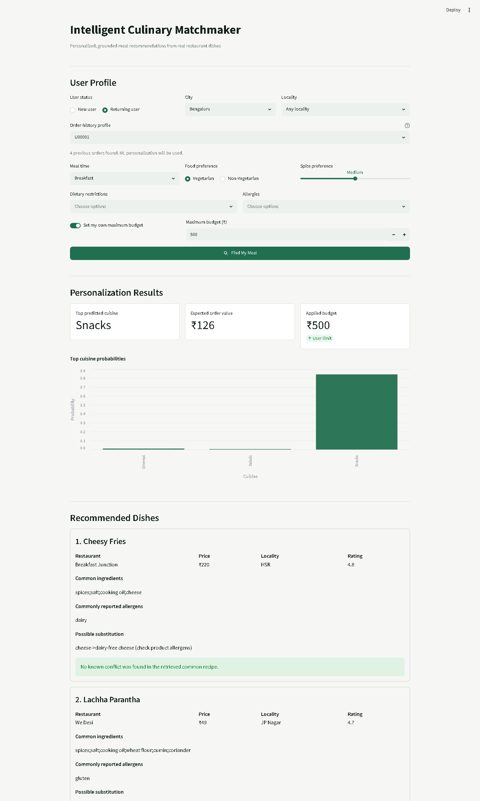
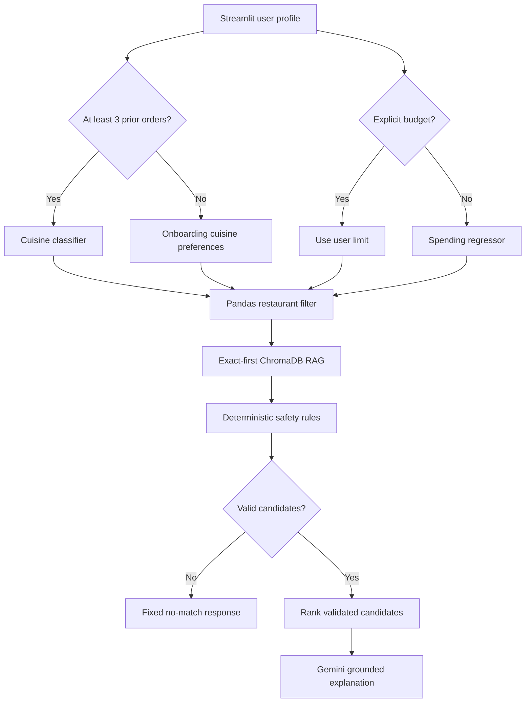
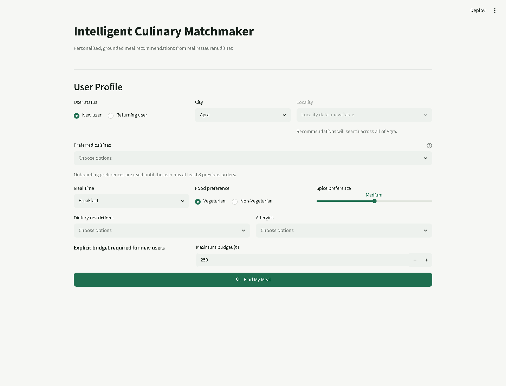

# Intelligent Culinary Matchmaker and Personalized Menu Agent

[](https://www.python.org/)
[](https://streamlit.io/)
[](https://www.langchain.com/langgraph)
[](https://scikit-learn.org/)

An end-to-end culinary recommendation system that predicts cuisine preference and expected spending, retrieves real restaurant dishes, enriches them with culinary knowledge, applies deterministic dietary safety rules, and asks Gemini to explain only validated recommendations.

The project is designed around one important boundary: **the LLM explains recommendations, but it never decides allergy or dietary safety.**



## What The System Does

- Supports every new user through preferred-cuisine onboarding.
- Predicts a returning user's cuisine preference across 82 cuisine/category classes after three orders.
- Estimates expected order value when the user does not provide a budget.
- Filters real dishes by city, optional locality, cuisine, budget, and veg/non-veg preference.
- Retrieves ingredients, allergens, substitutions, and preparation knowledge using exact matching plus semantic RAG.
- Applies deterministic rules for lactose intolerance, vegan/vegetarian diets, gluten sensitivity, and peanut, tree-nut, egg, and soy allergies.
- Rejects known conflicts before any candidate reaches the LLM.
- Uses Gemini only to turn validated structured facts into a readable recommendation.
- Returns a fixed no-match response without calling the LLM when no valid candidate exists.

## Architecture



### Responsibility Boundaries

| Component | Responsibility |
| --- | --- |
| Cuisine classifier | Predict likely cuisine classes and probabilities |
| Spending regressor | Estimate expected order value when no budget is supplied |
| Pandas filter | Enforce location, price, cuisine, and food-preference constraints |
| RAG | Retrieve common recipe knowledge for shortlisted dishes |
| Safety engine | Detect known conflicts and assign deterministic safety states |
| LangGraph | Route execution, fallbacks, validation, and no-match behavior |
| Gemini | Explain supplied validated candidates without inventing facts |

## Verified Results

| Subsystem | Selected approach | Evaluation result |
| --- | --- | --- |
| Cuisine classification | Logistic Regression | 90.69% untouched-test accuracy across 82 classes and unseen users |
| Spending regression | Histogram Gradient Boosting | MAE INR 28.60, RMSE INR 39.21, R2 0.8320 |
| Semantic RAG | all-MiniLM-L6-v2 + ChromaDB | Precision@1 86.67%, Recall@3 93.33%, MRR 0.90 |
| Unknown-query rejection | Distance threshold 0.35 | 0% false acceptance on the labeled unknown-query set |

The classification notebook compares 12 classifier families, including logistic regression, linear and RBF SVM, Naive Bayes, random forests, Extra Trees, KNN, and XGBoost. `user_id` is used only to group historical orders and keep users isolated across train, validation, and test splits; it is never encoded as a model feature. The regression notebook compares 16 regression models. Model selection uses validation data; final metrics are reported on untouched test data.

## Data Snapshot

| Dataset | Size | Purpose |
| --- | ---: | --- |
| Cleaned restaurant dishes | 100,000 rows | Grounded restaurant and menu filtering |
| Restaurants represented | 8,348 | Restaurant-level candidate retrieval |
| Indian cities represented | 10 | City and available-locality filtering |
| Culinary knowledge base | 1,000 dishes | Ingredients, allergens, tags, substitutions, and RAG |
| Synthetic order history | 40,000 orders / 5,000 users | Classification and regression training |

The 5,000 synthetic users are training examples, not an application allowlist. Unseen users receive onboarding recommendations immediately and automatically become eligible for ML personalization when at least three historical orders are available. The final dish dataset is deduplicated by `restaurant_id + normalized_dish_name`.

## Safety Design

Safety checks occur before generation and use four explicit states:

- `Likely compatible`
- `Possible dietary conflict`
- `Rejected due to known conflict`
- `Ingredient information unavailable`

Only likely-compatible and warning candidates may reach Gemini. Rejected and unknown dishes are removed. The application never describes a dish as guaranteed safe, clinically safe, or allergy-safe because recipes and cross-contamination conditions vary by restaurant.

## Repository Structure

```text
.
|-- app.py                         # Streamlit application
|-- agentic_ai/
|   |-- workflow.py                # LangGraph state and routing
|   |-- tools.py                   # ML, filtering, RAG, and safety tools
|   `-- request_parser.py
|-- LLM/
|   `-- llm_generator.py           # Grounded Gemini generation
|-- rag/
|   |-- rag_pipeline.py            # Exact and semantic retrieval
|   `-- evaluate_rag.py
|-- src/
|   |-- ml_prediction.py
|   |-- spending_prediction.py
|   |-- dish_filter.py
|   `-- safety_rules.py
|-- notebooks/                     # Readable model-development workflows
|-- models/                        # Saved runtime model artifacts
|-- data/                          # Restaurant, knowledge, and history data
|-- vector_db/                     # Persistent ChromaDB index
|-- tests/                         # Focused inference and workflow checks
|-- docs/screenshots/
`-- requirements.txt
```

## Run Locally

### 1. Clone and enter the repository

```powershell
git clone https://github.com/Tanishq1596/Intelligent-Culinary-Matchmaker-and-Personalized-Menu-Agent.git
cd Intelligent-Culinary-Matchmaker-and-Personalized-Menu-Agent
```

### 2. Create a virtual environment

```powershell
python -m venv .venv
.\.venv\Scripts\Activate.ps1
python -m pip install --upgrade pip
pip install -r requirements.txt
```

### 3. Configure Gemini

Set the API key for the current PowerShell session:

```powershell
$env:GEMINI_API_KEY="your-gemini-api-key"
```

To store it for future terminals on Windows:

```powershell
setx GEMINI_API_KEY "your-gemini-api-key"
```

Open a new terminal after using `setx`. Never commit the key, a `.env` file, or `.streamlit/secrets.toml.

### 4. Start Streamlit

```powershell
python -m streamlit run app.py
```

Open `http://localhost:8501`. Stop the server with `Ctrl+C` in the terminal.

## Tests And Evaluation

Run the focused checks from the repository root:

```powershell
python tests/test_ml_prediction.py
python tests/test_spending_prediction.py
python tests/test_safety_rules.py
python tests/test_agent_workflow.py
```

Evaluate RAG retrieval:

```powershell
python rag/evaluate_rag.py
```

The model-development notebooks are intentionally readable and interview-oriented:

- `notebooks/cuisine_classification_model.ipynb`
- `notebooks/spending_regression_model.ipynb`
- `notebooks/dish_filtering.ipynb`

## Key Engineering Decisions

1. **Hard constraints are deterministic.** Budget, city, locality, and food preference are handled by Pandas rather than inferred by an LLM.
2. **Cold start is explicit.** New users select cuisines and a budget instead of receiving an unreliable model prediction without history.
3. **Identity is not predictive.** User IDs group orders but never enter the classifier, allowing behavior to generalize to unseen users.
4. **Explicit budget wins.** The regressor is used only when a returning user has not supplied a maximum budget.
5. **Retrieval is confidence-aware.** Exact dish matches are preferred; semantic matches must pass a distance threshold.
6. **Fallbacks remain controlled.** The workflow can try the second predicted cuisine but never relaxes dietary restrictions or silently raises the budget.
7. **Generation is grounded.** Gemini receives a compact context containing only validated dishes, restaurant names, prices, ingredients, conflicts, and known substitutions.
8. **Empty results bypass the LLM.** This saves latency and prevents invented alternatives.

## Current Limitations

- The restaurant dataset does not contain coordinates, so filtering is city/locality based rather than a true radius search.
- Ingredient records describe common recipes, not restaurant-confirmed formulations.
- The training history is synthetic; production returning-user personalization would read order events from an authenticated application database.
- Some restaurant ratings and locality fields are unavailable in the source data.

## Application Preview



## Disclaimer

This is an educational recommendation project, not a medical-safety system. Users with severe allergies must confirm ingredients, preparation methods, and cross-contamination risks directly with the restaurant.
